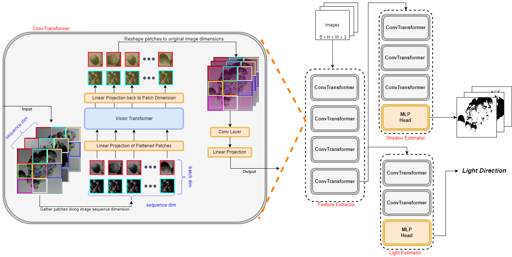

# DeepShadow Shadow Extraction Model
This repository is the code 
implementation for ECCV 2022 paper **supplementary**:
"DeepShadow: Neural Shape from Shadow".

The overview of our shadow and light extraction 
architecture is shown below:



## Requirements

* torch > 1.8
* opencv-python > 4.1
* numpy
* kornia > 0.6
* matplotlib
* einops > 0.3.1
* python

Our code was tested using Python 3.7/3.8 under Ubuntu 18.04, with GPU and/or CPU.

## Dataset Used in Paper
Coming soon

## Run Inference using the model
1. Clone the repo -
```bash
git clone https://github.com/asafkar/ps_shadow_extract.git
cd ps_shadow_extract/
```
2. Download and unzip the data
```bash

```
3. Install requirements
```bash
pip install -r requirements.txt
```
4. Run 
```bash
```


## Citation
If you use the model or dataset in your own research, please cite:
```
@inproceedings{karnieli2022deepshadow,	
		title={DeepShadow: Neural shape from shadows},
		author={Asaf Karnieli, Ohad Fried, Yacov Hel-Or},	
		year={2022},	
		booktitle={ECCV},
}
```


